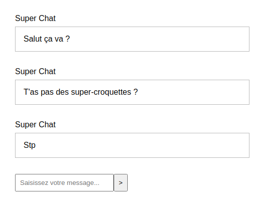

# Chatroom

On va construire un chat entièrement fonctionnel :scream:  
Pas de panique on va y aller étape par étape, ce soir on commence par pouvoir envoyer un message en utilisant Redux.  
On verra demain pour qu'on puisse nous répondre, tant pis si on parle tout seul pendant quelque temps :smile:

## Résultat



## Styles

On part au plus simple pour commencer, on peaufinera ensuite ;)

## Fonctionnalités

On doit pouvoir

- saisir un message dans le champ du bas
- soumettre ce message
- faire apparaître ce message dans la liste au-dessus, avec un nom d'auteur par défaut

Bien sûr **tu dois** utiliser **Redux** et **React Redux** pour gérer tes données et tes actions !

## Énoncé Aventurier

- Tout est dit :arrow_up:

## Énoncé Guidé

<details>
  <summary>
    Quelques pistes
  </summary>

Objectif : construire la ChatRoom

## 1 - Découpage structure statique
Dans le composant racine on identifie les zones principales de l'appli

- on décrit un sous-composant `Form` pour le formulaire
- on décrit un sous-composant `MessageList` pour le listing des messages
- on décrit un sous-composant `Message` pour le contenu d'un seul message

## 2 - Props : configuration des composants via les props

Le composant `Message` ne va pas afficher toujours le même non d'auteur et le même contenu.
  - dans `MessageList` à l'instanciation des `Message` on passe une prop contenant un IMessage (un objet contenant les propriétés author et content)
  - dans `Message` le composant on récupère la prop, on la type et on s'en sert

## 3 - Store : détenteur de la vérité

- on installe Redux
- on crée le store, le gardien du state, pour cela aide-toi du code produit en cours dans le dossier `store`

<details><summary>Solution pour créer le store</summary>

  ```ts
  import { configureStore } from '@reduxjs/toolkit';
  import monReducer from 'chemin/vers/reducer';

  const store = configureStore({
    reducer: {
      chat: monReducer, // Je renseigne mon reducer
    },
  });
  export default store;
  
  // Je déduis le type `RootState` et `AppDispatch` depuis le store lui même
  export type RootState = ReturnType<typeof store.getState>;
  // Inferred type: {posts: PostsState, comments: CommentsState, users: UsersState}
  export type AppDispatch = typeof store.dispatch;
  ```

</details>

- on crée le reducer à fournir au store, pour le moment il ne gère aucune action, pour cela aide-toi du reducer codé en cours
- il nous faut la liste des messages initiaux dans le state initial
<details><summary>Solution pour créer le reducer</summary>

  ```js
  interface ReducerState {
    /*
      spécifier le type de notre state
    */
  }
  const initialState = {
    /* 
      ranger les messages initiaux dans le state
    */
  };
  const monReducer = createReducer(initialState, () => {
  });

  export default monReducer;
  ```

</details>

## 4 - Provider : diffuseur du store

Notre store est notre interface pour dialoguer avec le state, on le veut partout
- on installe React-Redux
- on instancie le composant `Provider` à la racine de notre application, on passe le composant racine en enfant du provider
- on importe le store pour la passer en prop au provider

## 5 - Lecture des messages

Le composant `Messages` veut ses messages qui sont en principe dans le state connu du store. 
- Récupère le tableau des messages avec le hook `useSelector` de react-redux.
- Fais un `map` sur le tableau récupéré pour afficher autant de composant `Message` qu'il y a de messages dans le tableau. Passe à chaque composant `Message` le contenu de chaque message en props.
- comme toujours va voir le code du jour pour retrouver comment utiliser `useSelector` ou aide toi de la [documentation](https://react-redux.js.org/api/hooks)
- n'hésite pas à créer les hooks customs pour gérer les types automatiquement ([documentation](https://react-redux.js.org/using-react-redux/usage-with-typescript#define-typed-hooks))

## 6 - Ajout d'un message
Notre application sait afficher correctement des messages, il faut maintenant pouvoir en ajouter, on prépare un **champ contrôlé** puis on gère la soumission du formulaire

### 6.1 - Input controlé
On fait en sorte que la `value` du champ de notre composant `Form` dépende du state

##### Controle en lecture
- on définit une valeur initiale dans notre state initial
- dans le composant Form, on la récupère avec `useSelector` et on s'en sert pour la `value` de l'input

##### Controle en écriture
- Ajoute un écouteur d'évènement `change` sur l'input
- Dans le handler on va vouloir dispatcher une action (émettre une intention) il nous faut donc la fonction dispatch et l'action : 
  - Dans le composant Form, récupère la fonction `dispatch` du store avec le hook `useDispatch` de react-redux.
  - Prépare l'**action** qui va bien, utilise un action creator généré grace à `createAction` de react-redux.

  - Quand l'intention est émise, plus qu'à la traduire dans les faits donc :
  - on ajoute un `case` dans notre reducer pour gérer le cas de cette action et décrire comment devra évoluer le state en fonction de l'action
  <details><summary>Un exemple ?</summary>

    ```js
      const monReducer = createReducer(initialState, (builder) => {
        builder
          .addCase(monActionAvecParams, (state, action) => {
            state.yeah = action.payload;
          });
      });
    ```

  </details>

### 6.2 - Ajout du message au submit

- Ajoute un écouteur d'évènement `submit` sur le formulaire
- Dans le handler on va vouloir dispatcher une action (émettre une intention) il nous faut donc la fonction dispatch et l'action : 
  - Normalement tu as déjà récupéré la fonction `dispatch` du store avec le hook `useDispatch` de react-redux à l'étape précédente.
  - Prépare l'**action** qui va bien, sert toi de `createAction` de react-redux pour fabriquer un action creator.

  - Quand l'intention est émise, plus qu'à la traduire dans les faits donc :
  - on ajoute un `case` dans notre reducer pour gérer le cas de cette action et décrire comment devra évoluer le state en fonction de l'action

</details>

---

## Bonus

<details>
  <summary>
    S'il te reste du jus, un peu de CSS ?
  </summary>

### On peaufine

Rapproche toi de la capture ci-dessous en retravaillant tes styles


